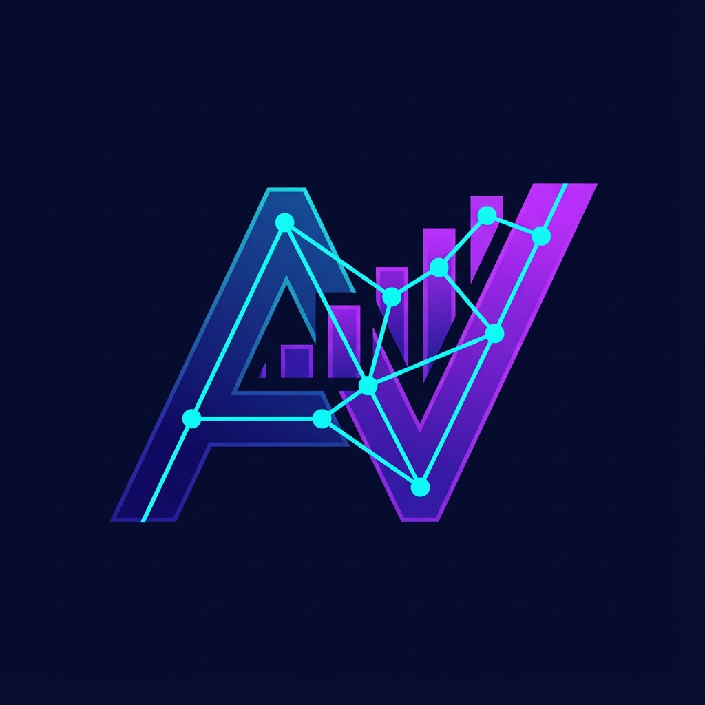

# AlgoVisual - Interactive Algorithm Visualizer



**AlgoVisual** is a modern, interactive web application designed to help users understand complex algorithms through beautiful, dynamic visualizations. Built with React, TypeScript, and Framer Motion, it offers a premium learning experience for students and developers alike.

## 🚀 Features

### 🔢 Sorting Algorithms
Visualize how different sorting algorithms organize data in real-time.
- **Bubble Sort**: The classic stepping stone.
- **Selection Sort**: Simple and intuitive.
- **Insertion Sort**: Building a sorted list one item at a time.
- **Merge Sort**: Divide and conquer.
- **Quick Sort**: Fast and efficient partitioning.
- **Heap Sort**: Tree-based selection.
- **Counting Sort**: Non-comparative integer sorting.
- **Radix Sort**: Digit-by-digit processing.

### 🔍 Searching Algorithms
Watch how algorithms find targets within data structures.
- **Linear Search**: Checking every element.
- **Binary Search**: Efficiently dividing the search space.

### 🕸️ Graph Algorithms
Explore pathfinding and traversal on interactive graphs.
- **BFS (Breadth-First Search)**: Exploring layer by layer.
- **DFS (Depth-First Search)**: Going deep before backtracking.
- **Dijkstra's Algorithm**: Finding the shortest path in weighted graphs.

### 🎒 Dynamic Programming
Visualize complex optimization problems broken down into subproblems.
- **Longest Common Subsequence (LCS)**: Finding patterns in strings.
- **0/1 Knapsack**: Optimizing value within weight limits.

### 💰 Greedy Algorithms
Understand algorithms that make locally optimal choices.
- **Activity Selection**: Scheduling non-conflicting tasks.
- **Counting Money**: Optimizing coin change (US currency).

### 🤖 AlgoBot
An integrated AI-powered chatbot assistant that can answer questions about algorithms, time complexity, and concepts while you learn.

## 🛠️ Tech Stack

- **Frontend**: React 18, TypeScript
- **Build Tool**: Vite
- **Styling**: CSS Modules, Modern CSS Variables
- **Animations**: Framer Motion
- **Icons**: Lucide React

## 🏁 Getting Started

### Prerequisites
- Node.js (v16 or higher)
- npm or yarn

### Installation

1.  Clone the repository:
    ```bash
    git clone https://github.com/Darkness947/Algo-visualizer.git
    ```

2.  Navigate to the project directory:
    ```bash
    cd Algo-visualizer
    ```

3.  Install dependencies:
    ```bash
    npm install
    ```

### Running Locally

Start the development server:
```bash
npm run dev
```
Open your browser and navigate to `http://localhost:5173`.

### Building for Production

Create a production-ready build:
```bash
npm run build
```
The output will be in the `dist` directory.

## 📄 License

This project is open source and available under the [MIT License](LICENSE).

---

Developed with ❤️ by [Darkness947](https://github.com/Darkness947)
